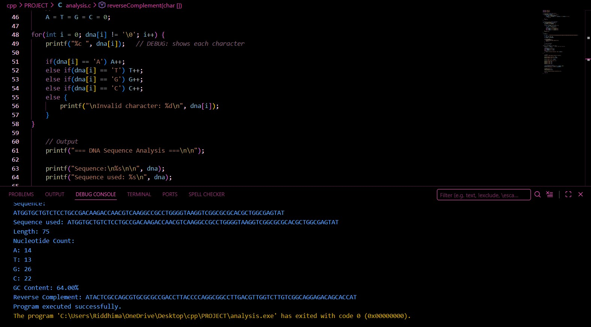
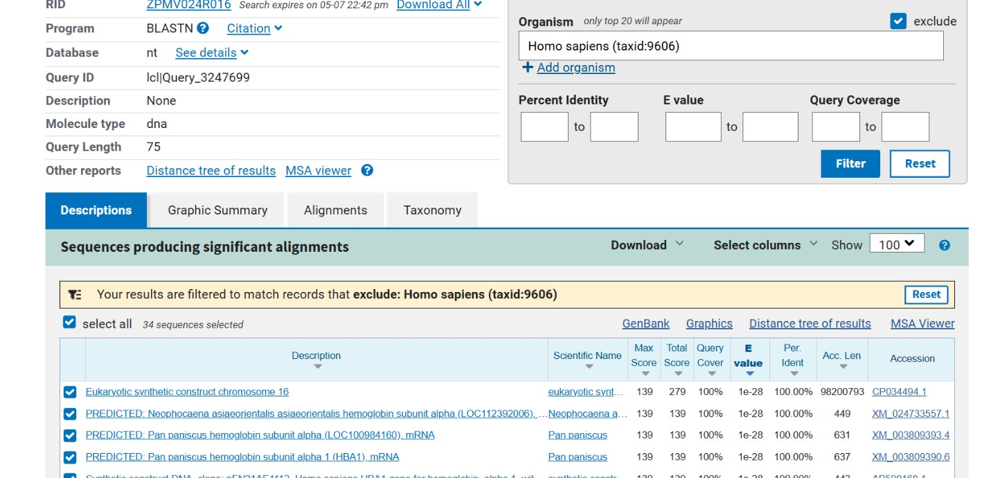
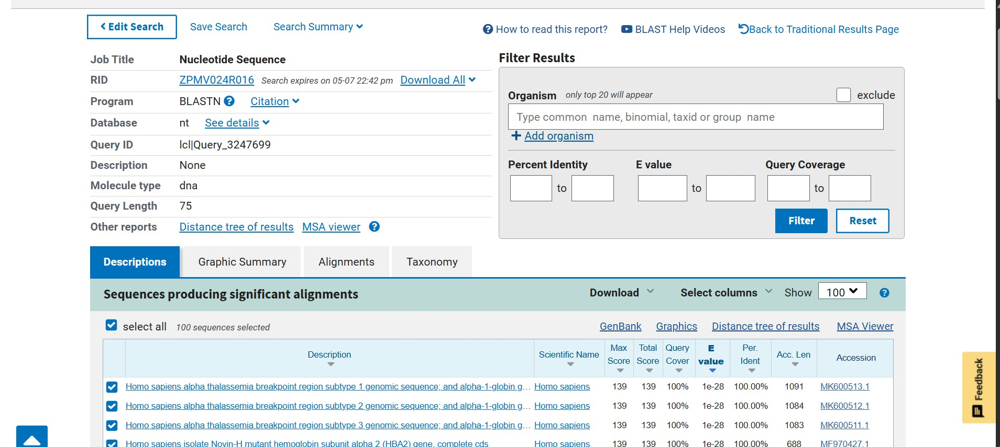
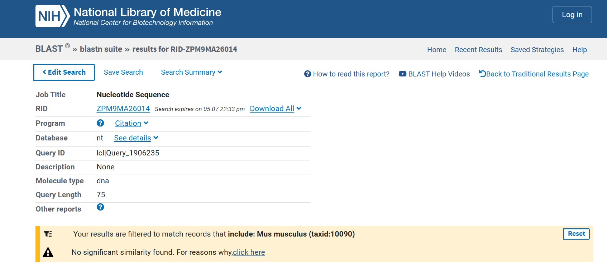

# Integrated DNA Sequence Analysis: Human HBA1 Gene
**Computational Analysis (C) & Bioinformatics Validation (BLAST)**

## 1. Abstract
This project analyzes a 75-bp DNA sequence using a dual-method approach. A C program was used to calculate structural properties (GC content and reverse complement), while NCBI BLAST was utilized to identify the sequence's biological origin and evolutionary conservation.

## 2. Methodology
The sequence analyzed: `ATGGTGCTGTCTCCTGCCGACAAGACCAACGTCAAGGCCGCCTGGGGTAAGGTCGGCGCGCACGCTGGCGAGTAT`

### 2.1 Analysis Cases
* **Case 1:** BLAST excluding Humans (*Homo sapiens*).
* **Case 2:** BLAST with no filters (Global search).
* **Case 3:** BLAST with Mouse (*Mus musculus*) filter.

### 2.2 Computational Analysis using C
A C program was developed to:
* Count Adenine (A), Thymine (T), Guanine (G), and Cytosine (C)
* Calculate GC content
* Determine sequence length
* Generate reverse complement

### 2.3 Sequence Alignment using BLAST
The same sequence was analyzed using NCBI BLAST under three conditions:
1. With organism filter (*Mus musculus*)
2. Without any filter
3. Excluding *Homo sapiens*

## 3. Results

### 3.1 Computational Output (C)
The C program successfully calculated the nucleotide distribution. The GC content of **64.00%** indicates high thermal stability due to the triple hydrogen bonds in G-C pairs.

### 3.2 Evolutionary Conservation (Case 1: Human Excluded)
When humans are excluded, the sequence still shows **100% identity** across primates and other mammals. This suggests the gene region is under strong "purifying selection," meaning it is too important to change over millions of years.

### 3.3 Identification (Case 2: No Filter)
The global search confirms a **100% identity** match with the **Human Hemoglobin Alpha (HBA1/HBA2)** gene region. This region is critical for oxygen transport in red blood cells.

### 3.4 Divergence Study (Case 3: Mouse Filter)
The search returned "No significant similarity" for the mouse genome. This demonstrates that while the Hemoglobin Alpha gene exists in mice, this specific 75-bp segment has evolved enough differences to be unique to humans and primates.

---

## 4. Conclusion
The 75-bp sequence is a highly stable, conserved region of the human alpha-globin gene. This project successfully demonstrates how C programming can be used alongside professional bioinformatics tools to verify and interpret genomic data.
